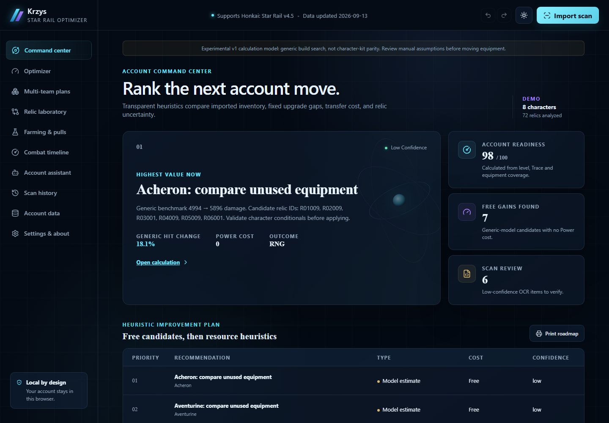

# Krzys Star Rail Optimizer

**Supports Honkai: Star Rail v4.5 · Optimizer v1.1.1 · Data updated 2026-09-13**

[Repository](https://github.com/moderatorowich-ctrl/krzys-star-rail-optimizer) · [Feature status](docs/FEATURE_STATUS.md) · [Version policy](docs/VERSION_SUPPORT.md)



Krzys Star Rail Optimizer is a privacy-first, account-wide experimental build laboratory for Honkai: Star Rail. It combines deterministic relic search, fixed-roster joint equipment assignment, transparent generic combat math, relic triage, planning heuristics, scan history, and a calculation-backed local assistant in one static application. Account calculations run in the browser; expensive searches run in Web Workers.

## Highlights

- Character optimizer with exhaustive and heuristic modes, stat/main-stat/set/substat constraints, pin/exclude controls, progress, cancellation, equipped-build comparison, explanations, and deterministic alternatives.
- Joint relic allocation for two fixed teams with no shared relics and conflict-aware transfer instructions.
- Account Command Center that ranks free equipment candidates before progression and relic-farming heuristics.
- Character-relative relic scores, unfinished-relic potential, roll analysis, stop-point advice, salvage/lock/review actions, and unused-quality alerts.
- Generic critical, non-critical, average, Break, Super Break, DoT, follow-up, summon, and multi-target calculations with formula breakdowns and explicit manual assumptions.
- Trailblaze Power priority heuristics, pull probability, generic combat timelines, speed-tuning diagnostics, snapshots, rollback, privacy-safe account export, and a deterministic local assistant.
- An opt-in, authenticated local live-import path for reviewed characters, relics, Light Cones, equipped-item updates, and Warp resources. The scanner and browser communicate only through the loopback interface on the same computer.
- A separately packaged GPL-3.0 Windows scanner using visible foreground-window capture and local OCR, with fast pipelined capture, catalog-assisted recognition, tier-constrained Speed-decimal recovery, enhanced-item reconciliation, pause/resume/cancel, global F8 stop, mandatory review, recovery, redacted diagnostics, and versioned exports.

## Use

The hosted app starts with a fully anonymous demonstration account so every calculation path is usable immediately. Open **Data & import** to import a Krzys scanner export or a supported common scanner JSON file. Validation and schema migration happen before account state is replaced. Account exports redact UID by default.

For a public showcase import, enter a public UID in **Data & import**. The browser contacts the public `api.mihomo.me` profile endpoint only after you submit the UID. It does not request or store a HoYoverse password.

Account data, settings, history, and saved snapshots use browser local storage. **Account data → Reset account** clears them after confirmation. There is no analytics, advertising, hidden telemetry, or automatic cloud upload.

## Krzys HSR Scanner

Install [Tesseract OCR for Windows](https://tesseract-ocr.github.io/tessdoc/Downloads.html), download the [latest scanner release](https://github.com/moderatorowich-ctrl/krzys-star-rail-optimizer/releases/latest), extract it, launch `Krzys-HSR-Scanner.exe`, and follow the guided capture flow. Keep the game UI in English, use a supported 16:9 layout, and correct every captured item before export. The scanner never needs administrator privileges for normal capture; if Windows or the game prevents capture, prefer borderless/windowed mode instead of elevation.

The scanner reads only visible pixels. It never injects code, reads game memory, modifies files, intercepts traffic, touches credentials, bypasses anti-cheat, automates combat, or uploads data. Optional navigation input and debug screenshots are off by default. F8 stops scanner input immediately. See [scanner safety and operation](docs/SCANNER.md).

## Development

Requirements: Node.js 22+, npm, Python 3.12+, Tesseract OCR, and Windows for producing the final `.exe`.

```powershell
npm ci
npm run dev
npm run verify
npm run test:e2e
python -m pip install -r apps/scanner/requirements.txt
npm run scanner:build
```

`npm run build` emits a static project-path build to `dist/`. GitHub Actions verifies types, lint, formatting, unit/regression tests, OCR tests, accessibility, browser integration, broken links, production dependencies, and the Pages base path before deployment. See [deployment](docs/DEPLOYMENT.md) and [architecture](docs/ARCHITECTURE.md).

## Known limitations

- Version 1.1.1 materially expands scanner and account-sync coverage, but it does not yet have full Fribbels character-kit, conditional, benchmark, or GPU-search parity. See the exact [feature status](docs/FEATURE_STATUS.md).
- Combat, encounter, upgrade, farming, and auto-battle scores are documented generic or heuristic models, not clear guarantees.
- Character-specific scripted kits, current encounter definitions, lineup search, every conditional set effect, and every localization OCR profile are not implemented.
- Public showcase import is limited to what the third-party Mihomo public profile endpoint exposes and may be unavailable independently of this app.
- OCR accuracy depends on resolution, scaling, UI language, capture clarity, and the locally installed Tesseract engine. Visible Speed decimals are retained exactly; hidden decimals are inferred only when legal roll tiers identify them, and ambiguous candidates stay visibly marked for review.
- The Windows release is not Authenticode-signed, so SmartScreen may warn on first launch.
- Exact optimizer mode is intended for constrained inventories. Large candidate pools should use the labeled heuristic mode and compare near-optimal alternatives.

## Data, licensing, and disclaimer

Version 4.5 was verified against the [official HoYoLAB update notice](https://www.hoyolab.com/article/46449452). Normalized character, Light Cone, and relic-set metadata is derived from the MIT-licensed Fribbels dataset at the exact revision recorded in the manifest. The web app and engines are MIT-licensed; the independently implemented scanner package is GPL-3.0-only. See [data sources](docs/DATA_SOURCES.md), [licensing](docs/LICENSING.md), and [third-party notices](THIRD_PARTY_NOTICES.md).

This is an unofficial fan project. It is not affiliated with, endorsed by, or sponsored by HoYoverse. Honkai: Star Rail and related names are trademarks of their respective owners.
